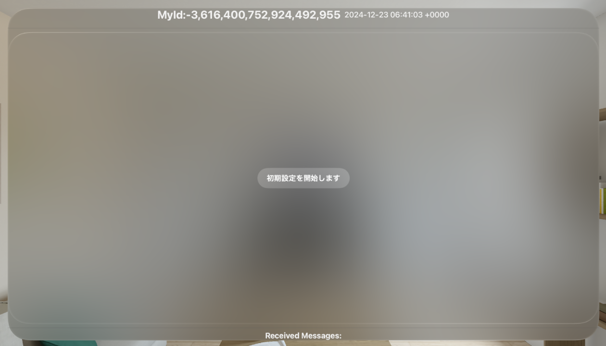
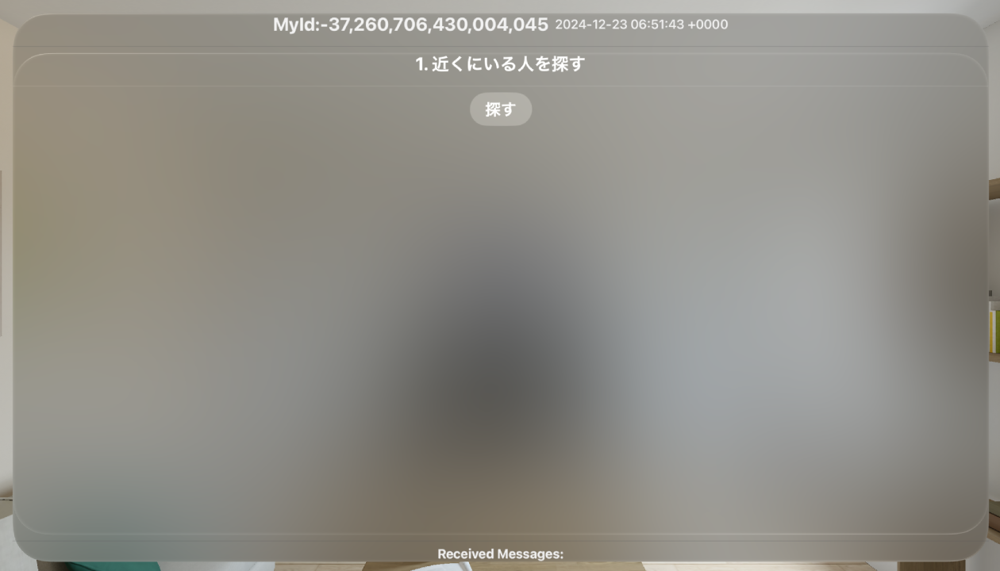
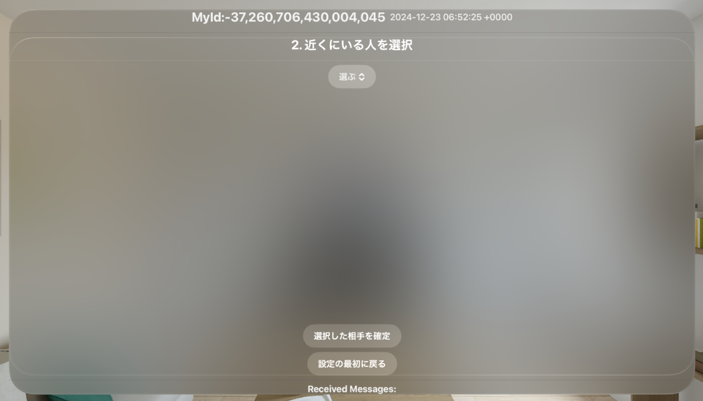
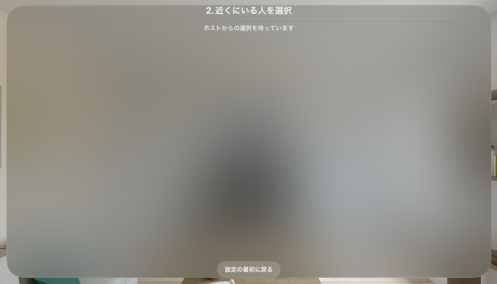
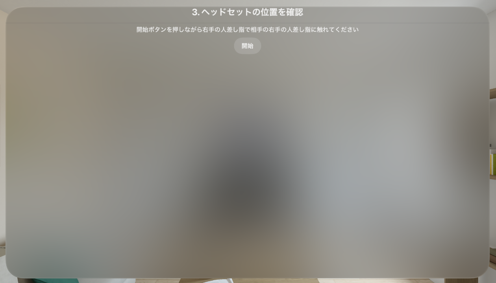
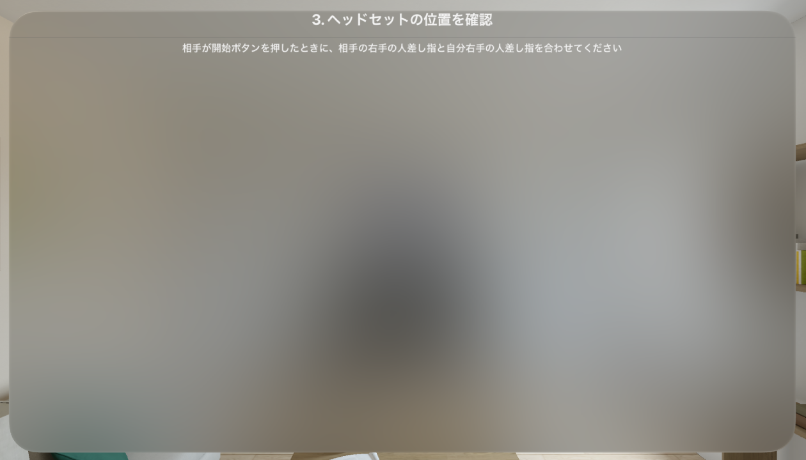
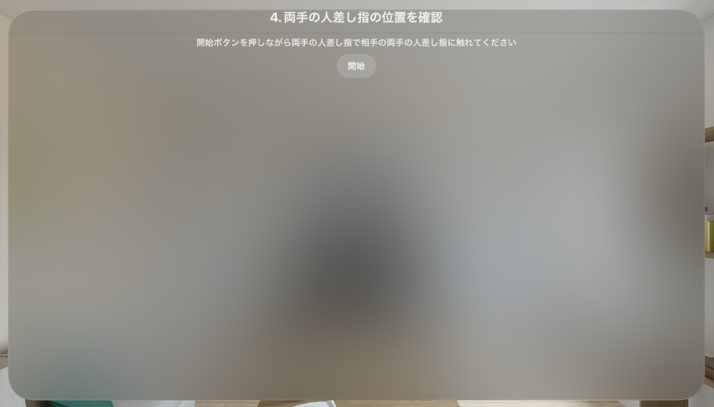
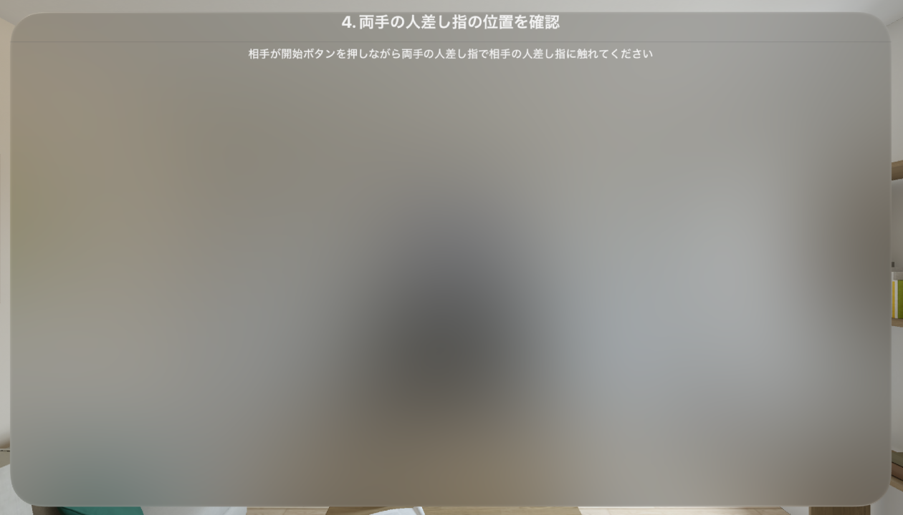
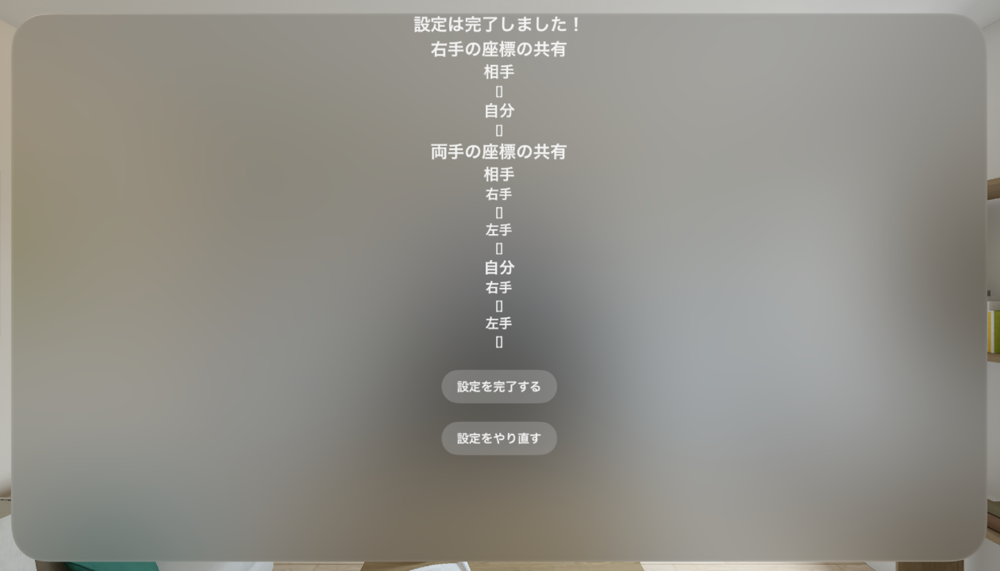

# multipeer-share-coordinate-throw-ball

VisionPro の座標変換を行うテンプレートアプリ

# 接続の流れ

## 事前情報

ホストに指定されたクライアントを A,指定されなかった方を B とする  
A,B はプログラム内部で自動的に決定される。決定されるタイミングについても次の[接続のステップ](#接続のステップ)に示す

## 接続のステップ

0. A,B がアプリを立ち上げる

   - `Show Immersive Space` ボタンが表示される
   - ボタンを選択して次の画面に遷移する

1. A,B がアドバタイズを開始する

   1. 自分の ID（hash 値）が閲覧可能になる
      
   2. プログラムの内部的にアドバタイズしている他端末の（hash 値）が閲覧可能になる
      

2. A と B の P2P 通信の確立

   - A の画面
     
   - B の画面
     

   1. 一番 hash 値の大きいクライアントがホスト（A）に指定される
   2. A が B の hash 値を選択
   3. A が 選択を確定
      1. A が B の hash 値を保存
      2. A が B に　`selectClient:<A の hash 値>` の文字列を送信
   4. B が `selectClient:<A の hash 値>` の文字列を受信
      1. B が A の hash 値を保存
      2. B が A に　`receivedSelect` の文字列を送信
      3. B が次の画面に遷移する
   5. A が `receivedSelect` の文字列を受信
      1. A が次の画面に遷移する

3. A,B の右手の人差し指を合わせる

   - A の画面
     
   - B の画面
     

   1. A が開始ボタンを押す
      - B に `reqRightIndexFingerCoordinates` の文字列を送信
      - A の右手の人差し指の座標の取得して保存
   2. B は UNIX タイムと右手人差し指の座標を返す
      - [右手人差し指座標の送信形式](#右手人差し指座標の送信形式) を返す
   3. 取得が上手くいかなかった場合は A の判断でやり直す
      - `いいえ` ボタンを押してやり直す
   4. 取得が上手くいったら A が `はい` ボタンを押す
      - B に `successRightIndexFingerCoordinates` の文字列を送信
   5. B が `successRightIndexFingerCoordinates` の文字列を取得したら
      - A に `receivedSuccessRightIndexFingerCoordinates` の文字列を送信
      - B が次の画面に遷移する
   6. A が `receivedSuccessRightIndexFingerCoordinates` の文字列を取得したら
      - A が次の画面に遷移する

4. 両手の人差し指を合わせる

   - A の画面
     
   - B の画面
     

   1. A が 開始ボタンを押す
      - B に `reqBothIndexFingerCoordinate` の文字列を送信
      - A の両手の人差し指の座標の取得して保存
   2. B が両手の人差し指の座標を返す
      - [両手の人差し指座標の送信形式](#両手の人差し指座標の送信形式) を返す
   3. 取得が上手くいかなかった場合は A の判断でやり直す
      - `いいえ` ボタンを押してやり直す
   4. 取得が上手くいったら A が `はい` ボタンを押す
      - B に `successBothIndexFingerCoordinate` の文字列を送信
   5. B が `successBothIndexFingerCoordinate` の文字列を取得したら
      - A に `receivedSuccessBothIndexFingerCoordinate` の文字列を送信
      - B が次の画面に遷移する
   6. A が `receivedSuccessBothIndexFingerCoordinate` の文字列を取得したら
      - A が次の画面に遷移する

5. A が B から受けとった座標を元に座標変換行列を計算する **（WIP）**

> [!CAUTION]
> 座標変換行列は現状作成されていません

- 

1.  A が座標変換行列を作成し、保存
2.  `設定を完了する` ボタンを押してメインのアプリケーションに遷移する

## データ形式

### 右手人差し指座標の送信形式

```json
resRightIndexFingerCoordinates{
   "unixTime":1734937558,
   "rightIndexFingerCoordinates": [
      [0.40366337, 0.8310663, -0.3826025, 0.0],
      [0.7926168, -0.5265297, -0.30744928, 0.0],
      [-0.4569624, -0.17915116, -0.8712579, 0.0],
      [-0.14012252, 0.8925083, -0.35628262, 0.99999994]
   ]
}
```

### 両手の人差し指座標の送信形式

```json
resBothIndexFingerCoordinate{
   "unixTime":1734937558,
   "left" :[
      [0.40366337, 0.8310663, -0.3826025, 0.0],
      [0.7926168, -0.5265297, -0.30744928, 0.0],
      [-0.4569624, -0.17915116, -0.8712579, 0.0],
      [-0.14012252, 0.8925083, -0.35628262, 0.99999994]
   ],
   "right":[
      [0.40366337, 0.8310663, -0.3826025, 0.0],
      [0.7926168, -0.5265297, -0.30744928, 0.0],
      [-0.4569624, -0.17915116, -0.8712579, 0.0],
      [-0.14012252, 0.8925083, -0.35628262, 0.99999994]
   ]
}
```

# プロジェクト構造

```
multipeer-share-coordinate-throw-ball
├── AppModel.swift
├── ContentView.swift
├── DevicePosition.swift
├── ImmersiveView.swift
├── Info.plist
├── PeerManager.swift
├── ToggleImmersiveSpaceButton.swift
├── TransformationMatrixPreparationView.swift
├── multipeer-share-coordinate-throw-ball.entitlements
└── multipeer_share_coordinate_throw_ballApp.swift
```

## `AppModel.swift`

デフォルトのまま

## `PeerManager.swift`

P2P 通信と座標の交換を行うための機能を持つ

### プロパティ

`transformationMatrixPreparationState` : 座標変換行列の計算のための座標交換の状態管理

`rightIndexFingerCoordinates` : A が受け取った右手の人差し指の座標

`bothIndexFingerCoordinate` : A が受け取った両手の人差し指の座標

`myRightIndexFingerCoordinates` : 自分の右手の人差し指の座標

`myBothIndexFingerCoordinate` : 自分の両手の人差し指の座標

`isUpdatePeerManagerRightIndexFingerCoordinates` : 右手の人差し指の座標を更新するかどうか（false になると更新が止まる）

`isUpdatePeerManagerBothIndexFingerCoordinate` : 両手の人差し指の座標を更新するかどうか（false になると更新が止まる）

`receivedMessage` : 受け取ったメッセージ

`sendMessagePeerList` : メッセージを送信する相手のリスト

`isHost` : 自分がホストかどうか

`peerID` : 自分の peerID

## `ContentView.swift`

immersive を起動するためのボタンと、座標変換のための行列を計算する機能

## `TransformationMatrixPreparationView.swift`

座標変換行列を計算するための画面

[#接続のステップ](#接続のステップ)に示した機能を実装した View

## `ToggleImmersiveSpaceButton.swift`

デフォルトのまま

## `DevicePosition.swift`

ハンドトラッキングを行うための機能

`ImmersionView` で使用する

## `ImmersiveView.swift`

ハンドトラッキングのデータを `PeerManager` に同期するために用いる
